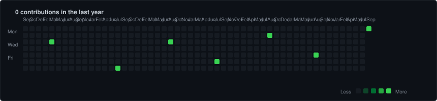

<!-- 1. contributions 指令 -->

  <code><b>zhangchengyan0305-hue@github</b>:<b>~</b># ./contributions.sh</code>

  

<!-- 2. whoami 指令 -->

  <code><b>zhangchengyan0305-hue@github</b>:<b>~</b># whoami</code>

<table>
  <tr>
    <td valign="top"></td>
    <td valign="top"></td>
  </tr>
</table>

# 👨‍💻 Hugo

> **Customer Quality Engineer (CQE) / Industrial Engineer (IE)**  
> *“Bridging business strategy with technical execution to drive operational excellence.”*

---

### 📍 Contact Information

- **Language Proficiency:** 🗣️ TOEIC 905 / 990 (Fluent in Listening, Speaking, Reading, and Writing)

---

### 👤 About Me

Graduated with a Bachelor's degree in Business Administration from a top-tier national university in Taiwan. During my academic tenure, I specialized in core technical and quantitative coursework including **Operations Management, Management Science, Business Statistics, C Programming, and System Simulation**, developing a dual advantage in cross-functional business communication and industrial engineering analytics.

I possess fluent bilingual communication skills (TOEIC 905) and practical experience in cross-departmental coordination, 8D/RCCA customer quality management, SFC product traceability, and shop floor continuous improvement. Furthermore, I leverage Python, Excel VBA, SQL, and n8n low-code tools to automate quality assurance and operational workflows, driving data-driven, lean, and scalable business processes.

*This site primarily serves as a personal repository to showcase my **programming learning journey, workflow automation projects, and technical implementations**. Technical exchanges and feedback are always welcome!*

---

### 💼 Work Experience

#### 🏢 Ingrasys Technology Inc. (Foxconn Technology Group)
**Customer Quality Engineer (CQE)** | `Aug 2025 - Dec 2025`
* **Customer Quality Interface & Deliverables:** Served as the primary quality contact for a major US tech client, delivering production quality reports, tracking key metrics, and developing Excel VBA tools to automate data analytics.
* **Cross-Functional Alignment & 8D / RCCA:** Coordinated across Manufacturing, Process Engineering, and Test Engineering teams to execute 8D methodologies, perform RCCA root-cause investigations, and author customer-facing CAPA reports.
* **Traceability & AOI Defect Troubleshooting:** Traceable inspection using Shop Floor Control (SFC) logs, line AOI (Automated Optical Inspection) images, and outgoing photos to pinpoint process breakdown points.
* **Elite Management Trainee Program:** Selected for and completed the corporate Fast-Track Management Program, acquiring end-to-end manufacturing exposure (SMT, Assembly, Testing, IQC, FA, and Warehouse), Lean Manufacturing, and supply chain collaboration.

#### 🏢 Digiwin Software Co., Ltd.
**Services Consultant Intern** | `Feb 2025 - Jun 2025`
* **PLM Systems & BOM Structure Management:** Managed Product Lifecycle Management (PLM) systems, BOM hierarchy construction, CAD drawing integrations, and Engineering Change Management (ECM) workflows.
* **Database Querying & Maintenance:** Executed SQL queries and Oracle database operations for data retrieval, dataset cleanup, and User Acceptance Testing (UAT).
* **Cross-System Integration:** Completed system integration modules between PLM and ERP systems, mastering enterprise information flows and business process logic within high-tech manufacturing.

---

### 🛠️ Professional Skills

| Domain | Skill Keywords |
| :--- | :--- |
| **Quality & Engineering (QC & IE)** | Customer 8D/RCCA · SFC/MES Traceability · AOI Image Analysis · PLM/ERP Systems · Lean Manufacturing · BOM Management |
| **Software & Automation** | Python · n8n Automation · Excel VBA · SQL / Oracle · OpenCV / MediaPipe · Docker Deployment |
| **Business & Languages** | TOEIC 905 · Cross-Functional Leadership · Technical Project Management · Business English Presentations |

---

### 🚀 Technical Projects

* **⚡ n8n Low-Code Automation Workflow & AI Deployment** (`Docker / RESTful API / Line Bot / AI Agent`)
  * **Self-Hosted Infrastructure:** Deployed a self-hosted n8n engine using Docker, configuring environment variables and volume persistence for zero-cost automated operations.
  * **Heterogeneous API Integration:** Configured Webhook endpoints connecting Line Messaging API, OpenWeatherMap, and Google Calendar for automated message parsing and calendar scheduling.
  * **AI Agent Guardrails:** Integrated LLM orchestration modules with constrained knowledge bases and defined tool boundaries to mitigate hallucinations and maintain output accuracy.
  * **Closed-Loop Data Reporting:** Connected Google Sheets API for automated event logging and periodic analytical chart delivery via instant messaging webhooks.

* **🖐️ MediaPipe Hand Tracking System** (`Python / OpenCV / Computer Vision`)
  * Implemented real-time tracking of 42 hand landmark coordinates utilizing MediaPipe Hands.
  * Developed computer vision algorithms calculating inter-joint angles and frame-by-frame velocity vectors to trigger composite events based on gesture dynamics (e.g., dual palm-up orientation and swing velocity).
  * Rendered real-time dynamic overlays using OpenCV, tuning decision threshold parameters to minimize gesture false-positive rates.

* **📊 Operational Analytics & Pricing Engine** (`Operations Management / Cost Accounting / Dashboard Automation`)
  * Deconstructed custom manufacturing cost structures, quantifying hidden labor hours and overhead into a dynamic pricing model.
  * Developed an automated order tracking system and backend data dashboard, improving brand operational margins by 10%.

* **🇩🇪 Overseas AI Smart Manufacturing Initiative** (`Technical Proposal Writing / International Industry-Academia Exchange`)
  * Authored a 15-page bilingual technical proposal titled *"When Quality Engineering Meets Fire Performance Arts"*, digitizing industrial engineering methodologies for creative enterprise management.
  * Selected for the national final round (top 15 nationwide quota) under the Ministry of Education's global exchange program.

---

  <i>© 2026 Hugo. All rights reserved.</i>

